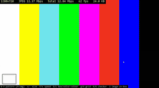
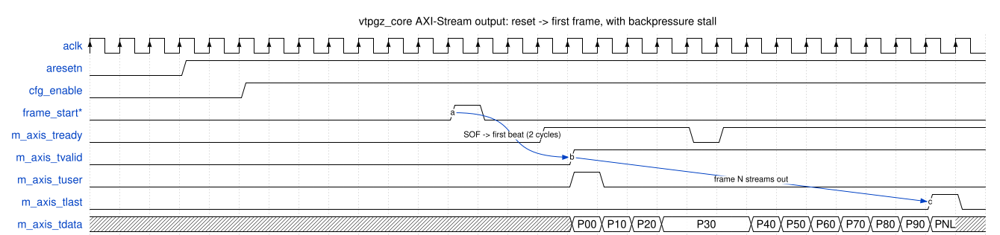

# vtpgZero — Video Test Pattern Generator

A synthesizable Verilog-2001 video test pattern generator IP core. Outputs
pixels over an AXI4-Stream master interface and is configured at runtime via
an AXI4-Lite slave register interface.

<p align="center">
  
</p>

## Index

- [What this project does](#what-this-project-does)
- [Features](#features)
- [Register map](#register-map-axi4-lite-32-bit)
- [How to use it](#how-to-use-it)
  - [Build-time parameters](#build-time-parameters)
  - [Using vtpgz_core (port-driven, no AXI slave)](#using-vtpgz_core-port-driven)
  - [Using vtpgz_axilite_top (AXI4-Lite controlled)](#using-vtpgz_axilite_top-axi4-lite-controlled)
  - [Programming sequence](#programming-sequence)
  - [External frame sync](#external-frame-sync)
  - [Multi-pixel-per-clock](#multi-pixel-per-clock)
  - [Output modes](#output-modes)
  - [Image patterns](#image-patterns)
- [How to test it](#how-to-test-it)
- [FPGA resource usage and frequency](#fpga-resource-usage-and-frequency)
- [File layout](#file-layout)
- [Author and license](#author-and-license)

## What this project does

`vtpgZero` produces video frames of various test patterns at programmable
resolution, pixel format, and bit depth. It can free-run from an internal
divider or be locked to an external frame-sync signal. The output stream is
standard AXI4-Stream with backpressure (`tready`), `tlast` = end of line, and
`tuser` = start of frame.

It ships in two flavors:

- **`vtpgz_core`** — direct port-driven core. No AXI slave; drive the `cfg_*`
  fields from your own RTL (or tie them to constants for a fully static
  build). The smallest, most portable form.
- **`vtpgz_axilite_top`** — thin wrapper that adds an AXI4-Lite slave so a
  CPU/host can configure the core at runtime. This is what the Arty A7-100T
  demo uses.

Both have **identical** pattern/output behavior — they only differ in how the
`cfg_*` fields get set.


[↑ back to top](#index)

## Features

- **8 patterns**: SMPTE color bars, horizontal gradient, vertical gradient,
  checkerboard, solid color, crosshatch/grid, color ramp, LFSR
  pseudo-random noise.
- **Bouncing box overlay**: optional animated box drawn on top of any
  pattern. Color, size, speed, and border are runtime-configurable; it
  bounces off the frame edges. Stripped at elaboration when `EN_MOVING_BOX=0`.
- **3 build-time output modes** (pick one at synthesis):
  - **RGB** — RGB888 / RGB101010 / RGB121212
  - **RAW** — single-component: plain monochrome, or any of the 4 standard
    Bayer mosaics (RGGB / BGGR / GRBG / GBRG). Smallest configuration, useful
    as an image-sensor emulator.
  - **YUV** — native BT.601-style 4:4:4 or 4:2:2 (patterns produce
    `{Y,Cb,Cr}` directly, no runtime color conversion).
- **5 bit depths** (build-time): 8 / 10 / 12 / 14 / 16 bits per component.
  Patterns render at 12-bit precision; the pack stage truncates LSBs for
  `BPC<12` and zero-extends for `BPC>12`.
- **Pixels-per-clock (1/2/4/8)**: pack 1, 2, 4, or 8 horizontally-adjacent
  pixels into each AXI4-Stream beat for higher line bandwidth. All patterns
  and output modes are supported; `PIXELS_PER_CLOCK=1` (default) is
  byte-identical to prior releases.
- Auto-derived `tdata` width — the smallest multiple-of-8 that fits the
  active components for the chosen mode/bpc. No manual sizing needed.
- **AXI4-Lite** slave for runtime configuration (18 writable registers).
- **AXI4-Stream** master output with full backpressure support.
- **Frame sync**: internal (clock divider) or external (rising-edge input).
- **Build-time pattern selection**: each pattern is gated by an `EN_*`
  parameter and stripped from the netlist when set to `0`.
- Pure **Verilog-2001**, no SystemVerilog, no vendor primitives.
- **100% Verilator code coverage** (line + toggle) under the bundled
  testbench, plus a byte-exact RTL↔model gate and on-silicon hardware
  verification.


[↑ back to top](#index)

## Register map (AXI4-Lite, 32-bit)

| Offset | Name           | Description                                          |
|--------|----------------|------------------------------------------------------|
| 0x00   | CORE_ID        | **RO** fixed magic `0x47505456` = ASCII "VTPG" little-endian. Read this first to confirm you're talking to a vtpgZero core. |
| 0x04   | VERSION        | **RO** `{major[8], minor[8], patch[16]}`             |
| 0x08   | CONTROL        | `[0]` enable, `[1]` sw_fsync, `[2]` ext_sync         |
| 0x0C   | STATUS         | **RO** `[0]` busy, `[15:8]` frame_count              |
| 0x10   | IMG_WIDTH      | active pixels per line                                |
| 0x14   | IMG_HEIGHT     | active lines per frame                                |
| 0x18   | PATTERN_SEL    | 0=colorbar 1=hgrad 2=vgrad 3=checker 4=solid 5=(reserved) 6=grid 7=ramp 8=noise 9=image |
| 0x1C   | COLOR_FORMAT   | **RO** build-time configuration mirror: `[1:0]`=output_mode (0=RGB 1=RAW 2=YUV), `[2]`=yuv_subsample (0=444 1=422), `[5:3]`=raw_bayer (0=PLAIN 1=RGGB 2=BGGR 3=GRBG 4=GBRG), `[6]`=rgb_order (0=Xilinx 1=legacy), `[15:8]`=BPC (8/10/12/14/16), `[31:16]`=TDATA_WIDTH |
| 0x20   | SOLID_COLOR    | `{8'h0, R[8], G[8], B[8]}`                           |
| 0x24   | BOX_COLOR      | moving box color                                     |
| 0x28   | BOX_SIZE       | `{width[16], height[16]}`                            |
| 0x2C   | BOX_SPEED      | `{dx[16], dy[16]}` pixels per frame                  |
| 0x30   | PIXELS_PER_CLOCK | **RO** build-time pixels-per-AXI-beat (1/2/4/8)     |
| 0x34   | GRID_SPACING   | grid line spacing in pixels                          |
| 0x38   | GRID_COLOR     | grid line color                                      |
| 0x3C   | CHECKER_SIZE   | checkerboard square size in pixels                   |
| 0x40   | FRAME_RATE_DIV | clocks per frame for internal sync mode              |
| 0x44   | BAR_WIDTH      | colorbar width in pixels (host writes `img_width/8`) |
| 0x48   | HG_STEP        | horizontal-gradient step per pixel (`0xFFF/(width-1)`) |
| 0x4C   | VG_STEP        | vertical-gradient step per line (`0xFFF/(height-1)`)   |
| 0x50   | BOX_BORDER     | `{border_width[8], border_color[24]}`. Border is drawn inside the box; `border_width=0` means no border. |
| 0x54   | BOX_IMG_X_STEP | Q16 nearest-neighbour step for the box-image overlay. Host writes `(BOX_IMAGE_W << 16) / BOX_SIZE.width` whenever `BOX_SIZE` changes. Only meaningful when `EN_BOX_IMAGE=1`. |
| 0x58   | BOX_IMG_Y_STEP | Q16 step for the box-image overlay y-axis. Host writes `(BOX_IMAGE_H << 16) / BOX_SIZE.height`. |

AXI4-Lite writes honor `WSTRB` byte lanes. A write with `WSTRB=0`
acknowledges but leaves the addressed register unchanged, including
`CONTROL`. The `COLOR_FORMAT` register (0x1C) is **read-only** and reflects
the build-time configuration so software can probe it.


[↑ back to top](#index)

## How to use it

Everything is portable Verilog-2001 with no vendor primitives:

```
rtl/vtpgz_defs.vh        `include this header (or add rtl/ to your include dirs)
rtl/vtpgz_core.v         the substance: timing engine, patterns, inline pack
                         stage, AXIS output. Configured via cfg_* input ports.
rtl/vtpgz_axil_regs.v    AXI4-Lite slave + register file (only needed with the
                         AXI-Lite wrapper)
rtl/vtpgz_axilite_top.v  thin wrapper that adds the AXI4-Lite slave on top of
                         vtpgz_core for runtime control
```

A `vtpgz_core`-only build pulls in just `vtpgz_defs.vh` and `vtpgz_core.v`.
The AXI-Lite flavor adds the other two files.

### Build-time parameters

| Parameter | Default | Effect |
|---|---|---|
| `C_S_AXI_ADDR_WIDTH` | 8 | AXI4-Lite address width (8 = 256 B, enough for all regs) |
| `C_S_AXI_DATA_WIDTH` | 32 | AXI4-Lite data width (only 32 supported) |
| `EN_COLORBAR` … `EN_NOISE` | 1 | Per-pattern enables. Set to 0 to strip that generator from the netlist. At least one must remain enabled. |
| `EN_MOVING_BOX` | 1 | Bouncing-box overlay. When 1, the box is drawn on top of any active pattern. |
| `EN_IMAGE` | 0 | Embed a synth-time image as `PATTERN_SEL=9` (inferred BRAM). Stripped when 0. See [Image patterns](#image-patterns). |
| `EN_BOX_IMAGE` | 0 | Paint an embedded image inside the moving box. Requires `EN_MOVING_BOX=1`. See [Image patterns](#image-patterns). |
| `IMAGE_W` / `IMAGE_H` | 128 | Source image size in BRAM (powers of two). Plus `IMAGE_OUT_W/H`, `IMAGE_HEX_FILE` — see [Image patterns](#image-patterns). |
| `BOX_IMAGE_W` / `BOX_IMAGE_H` | 32 | Box-image source size. Plus `BOX_IMAGE_HEX_FILE`. |
| `OUTPUT_MODE` | 0 (RGB) | **0** = RGB; **1** = RAW; **2** = YUV. See [Output modes](#output-modes). |
| `YUV_SUBSAMPLE` | 0 (444) | Only for `OUTPUT_MODE=2`. **0** = 4:4:4; **1** = 4:2:2. |
| `RAW_BAYER` | 1 (RGGB) | Only for `OUTPUT_MODE=1`. **0** = plain monochrome; **1** = RGGB; **2** = BGGR; **3** = GRBG; **4** = GBRG. |
| `RGB_ORDER` | 0 (Xilinx) | Component order in `tdata`. **0** = `{pad,B,G,R}` (Xilinx PG044); **1** = `{R,G,B,pad}` legacy MSB-first. |
| `BPC` | 8 | Bits per component: 8, 10, 12, 14, or 16. |
| `PIXELS_PER_CLOCK` | 1 | Pixels per AXI-Stream beat (1/2/4/8). See [Multi-pixel-per-clock](#multi-pixel-per-clock). |
| `PIX_TDATA_WIDTH` / `C_AXIS_TDATA_WIDTH` | (auto) | **Derived** — don't override. Per-pixel and full-beat `tdata` widths. |

### Using `vtpgz_core` (port-driven)

`vtpgz_core` exposes the configuration fields as plain input ports — the
`cfg_*` ports mirror the writable AXI-Lite register fields (`cfg_enable`,
`cfg_img_width`, `cfg_img_height`, `cfg_pattern`, `cfg_solid_color`,
`cfg_box_*`, `cfg_grid_*`, `cfg_checker_size`, `cfg_frame_rate_div`,
`cfg_bar_width`, `cfg_hg_step`, `cfg_vg_step`, …). Status outputs `sts_busy`
and `sts_frame_count[7:0]` are also exposed.

A typical fully-static instantiation — a 1920×1080 SMPTE colorbar generator
with no CPU in sight, free-running at 60 fps from a 130 MHz clock:

```verilog
vtpgz_core #(
    // Strip everything but colorbar to keep area minimal
    .EN_COLORBAR   (1),
    .EN_HGRAD      (0), .EN_VGRAD     (0), .EN_CHECKER (0),
    .EN_SOLID      (0), .EN_MOVING_BOX(0), .EN_GRID    (0),
    .EN_RAMP       (0), .EN_NOISE     (0),
    .OUTPUT_MODE   (0),  // 0=RGB 1=RAW 2=YUV
    .RGB_ORDER     (0),  // 0=Xilinx 1=legacy
    .BPC           (8)   // 8/10/12/14/16
) u_vtpgz (
    .aclk          (aclk),
    .aresetn       (aresetn),

    // Static configuration -- tie everything to its compile-time value.
    // The synth tool constant-folds disabled patterns and unused slots out.
    .cfg_enable        (1'b1),                  // run forever
    .cfg_sw_fsync      (1'b0),
    .cfg_ext_sync      (1'b0),                  // use internal frame sync
    .cfg_img_width     (16'd1920),
    .cfg_img_height    (16'd1080),
    .cfg_pattern       (4'd0),                  // colorbar
    .cfg_solid_color   (24'h000000),
    .cfg_box_color     (24'h000000),
    .cfg_box_width     (16'd0),
    .cfg_box_height    (16'd0),
    .cfg_box_dx        (16'd0),
    .cfg_box_dy        (16'd0),
    .cfg_grid_spacing  (16'd0),
    .cfg_grid_color    (24'h000000),
    .cfg_checker_size  (16'd0),
    .cfg_frame_rate_div(32'd2_166_666),         // 130 MHz / 60 fps
    .cfg_bar_width     (16'd240),               // 1920 / 8
    .cfg_hg_step       (16'd0),
    .cfg_vg_step       (16'd0),

    // Status -- leave dangling if you don't need them
    .sts_busy          (),
    .sts_frame_count   (),

    // AXI4-Stream master (video out)
    .m_axis_tdata      (vid_tdata),
    .m_axis_tvalid     (vid_tvalid),
    .m_axis_tready     (vid_tready),
    .m_axis_tlast      (vid_tlast),
    .m_axis_tuser      (vid_tsof),

    // External frame sync (only used when cfg_ext_sync=1)
    .frame_sync_in     (1'b0)
);
```

To drive `cfg_*` from your own RTL instead (an FSM that swaps patterns, a
sideband bus, etc.), just connect those signals to your logic instead of
constants — behavior is identical to a register write on the AXI-Lite flavor.
For the host-precomputed step values, use the same numbers as the
[Programming sequence](#programming-sequence) below.

#### Driving the AXI-Stream output

The core is **synchronous** to a single clock `aclk` with synchronous
active-low reset `aresetn`, and emits video on a standard AXI4-Stream master
(`tvalid` / `tready` / `tlast` = end-of-line / `tuser` = start-of-frame). To
bring it up: hold `aresetn` low ≥1 cycle then release, drive `cfg_*` to
stable values, assert `cfg_enable`, pick a frame-sync source (see
[External frame sync](#external-frame-sync)), and pull `m_axis_tready` high to
consume the stream.



Source: [docs/wavedrom/tdata_stream.json5](docs/wavedrom/tdata_stream.json5)
(regenerate with `python scripts/regen_wavedrom.py`). `Pxy` = pixel at column
x, row y; `PNL` = last beat of the line (`tlast=1`). In the window above
P00..P30 are consumed cleanly, then the sink drops `tready` for two clocks
while the core holds `tvalid=1` and the same `P30` on `tdata`; the next beat
advances as soon as `tready` rises again.

Key behaviors:

- **Latency from sync to first beat is 2 clocks.** `tuser`, `tlast`, and
  `tdata` are delayed together, so stream-visible frame contents are unchanged.
- **No blanking intervals** — the core streams the active picture only.
  Handle HBLANK/VBLANK downstream by holding `tready` low, or with a
  video-timing block.
- **Backpressure is honoured cycle-by-cycle.** On `tvalid && !tready` all
  pipeline stages stall in place; nothing is dropped or repeated.
- **Mid-frame syncs are dropped, not queued** — a `frame_start` while a frame
  is in flight is ignored (correct for a free-running vsync).
- **Reset clears all state**, so the first frame after `cfg_enable` rises uses
  fresh pattern-counter state.

### Using `vtpgz_axilite_top` (AXI4-Lite controlled)

`vtpgz_axilite_top` instantiates `vtpgz_axil_regs` and a `vtpgz_core`
back-to-back. Its public interface is an AXI4-Lite slave for control plus the
same AXI4-Stream master for video. Wire your AXI4-Lite master and use the
[Programming sequence](#programming-sequence) to configure it.

```verilog
vtpgz_axilite_top #(
    .C_S_AXI_ADDR_WIDTH (8),
    .C_S_AXI_DATA_WIDTH (32),
    // Per-pattern EN_* default to 1; strip unused ones to save area
    .OUTPUT_MODE   (0),  // 0=RGB 1=RAW 2=YUV
    .YUV_SUBSAMPLE (0),  // 0=444 1=422 (only for OUTPUT_MODE=2)
    .RAW_BAYER     (1),  // 0=PLAIN 1=RGGB 2=BGGR 3=GRBG 4=GBRG (only for OUTPUT_MODE=1)
    .RGB_ORDER     (0),  // 0=Xilinx 1=legacy
    .BPC           (8)   // 8/10/12/14/16
    // C_AXIS_TDATA_WIDTH is auto-derived; don't override
) u_vtpgz (
    .aclk (aclk), .aresetn (aresetn),
    // AXI4-Lite slave (control) — standard channels: aw/w/b/ar/r
    .s_axi_awaddr (axi_awaddr), .s_axi_awprot (axi_awprot),
    .s_axi_awvalid(axi_awvalid),.s_axi_awready(axi_awready),
    .s_axi_wdata  (axi_wdata),  .s_axi_wstrb (axi_wstrb),
    .s_axi_wvalid (axi_wvalid), .s_axi_wready(axi_wready),
    .s_axi_bresp  (axi_bresp),  .s_axi_bvalid(axi_bvalid),
    .s_axi_bready (axi_bready),
    .s_axi_araddr (axi_araddr), .s_axi_arprot(axi_arprot),
    .s_axi_arvalid(axi_arvalid),.s_axi_arready(axi_arready),
    .s_axi_rdata  (axi_rdata),  .s_axi_rresp (axi_rresp),
    .s_axi_rvalid (axi_rvalid), .s_axi_rready(axi_rready),
    // AXI4-Stream master (video). Width auto-derived from OUTPUT_MODE/BPC;
    // read it at runtime from COLOR_FORMAT[31:16] if needed.
    .m_axis_tdata (vid_tdata),  .m_axis_tvalid(vid_tvalid),
    .m_axis_tready(vid_tready), .m_axis_tlast (vid_tlast),  // end-of-line
    .m_axis_tuser (vid_tsof),                               // start-of-frame (1 bit)
    // External frame sync (used when CONTROL[2]=1)
    .frame_sync_in (ext_fsync)
);
```

The core has **one** clock domain (`aclk`) — AXI, pattern logic, and video
output are all clocked by it. If your video sink runs on a different clock,
put an asynchronous AXI4-Stream FIFO on the output. `m_axis_tuser` is 1 bit
(asserts on the first beat of each frame), matching the Xilinx convention.

### Programming sequence

1. Hold `aresetn` low for at least one `aclk` cycle and release.
2. Write `IMG_WIDTH`, `IMG_HEIGHT` to the desired resolution.
3. Write the host-precomputed step values (these replace per-pixel dividers
   with cheap accumulators in hardware):
   - `BAR_WIDTH = IMG_WIDTH / 8`              (colorbar bar width)
   - `HG_STEP   = 0xFFF / (IMG_WIDTH  - 1)`   (horizontal gradient step)
   - `VG_STEP   = 0xFFF / (IMG_HEIGHT - 1)`   (vertical gradient step)
4. Write `PATTERN_SEL` (0=colorbar, 1..4=gradients/checker/solid, 6=grid,
   7=ramp, 8=noise, 9=image). The bouncing box overlays whatever pattern is
   selected.
5. Optional pattern parameters: `SOLID_COLOR`, `BOX_COLOR`/`BOX_SIZE`/
   `BOX_SPEED`/`BOX_BORDER`, `GRID_SPACING`/`GRID_COLOR`, `CHECKER_SIZE`.
6. For internal sync mode (`CONTROL[2]=0`): write `FRAME_RATE_DIV` (one frame
   every N `aclk`s).
7. Write `CONTROL = 0x1` (enable). The core starts streaming.

To change configuration, write `CONTROL = 0` first, wait for the in-flight
frame to drain, then reprogram and re-enable. (`COLOR_FORMAT` is read-only —
it mirrors the build-time configuration; you never write it.)

### External frame sync

Drive `frame_sync_in` with any pulse-style signal that marks the start of a
frame and set `CONTROL[2] = 1` (`ext_sync` mode). The core does
**rising-edge detection** internally, so it accepts 1-clock pulses,
multi-clock pulses (including signals held high — only the edge counts), and
free-running periodic vsync at any rate slower than the frame emission time.
This is **directly compatible with Xilinx VTC's `vsync_out`**.

A rising edge that arrives while a frame is still in flight is **dropped**
(not queued) — correct for a free-running vsync. For latched-pending
behavior, add your own pending-bit FF before `frame_sync_in`.

### Multi-pixel-per-clock

At `PIXELS_PER_CLOCK` of 2/4/8, that many horizontally-adjacent pixels are
packed into one wider beat (lane 0 = leftmost pixel in the `tdata` LSBs),
multiplying line bandwidth. **Every** pattern and the moving-box overlay
(fill, border, box-image) produce beat-exact output, across all output modes
(RGB / RAW-Bayer / YUV 4:4:4 / YUV 4:2:2) and all bit depths. `IMG_WIDTH` is
clamped **down** to a multiple of `PIXELS_PER_CLOCK`. Only an illegal value
(not 1/2/4/8) fails elaboration; the active value is mirrored read-only at
register `0x30` so software can discover it.

The `PIXELS_PER_CLOCK=1` build is byte-identical to prior releases (the
per-lane logic is generate-gated behind `PPC>1`). NOISE uses a leap-ahead
LFSR so each lane gets consecutive states. IMAGE / BOX_IMAGE replicate their
source memory per lane — see [Image patterns](#image-patterns).

### Output modes

- **RGB** (`OUTPUT_MODE=0`) — 3-component RGB packed as `{pad,B,G,R}` (or
  `{R,G,B,pad}` with `RGB_ORDER=1`).
- **RAW** (`OUTPUT_MODE=1`) — 1 component per pixel. `RAW_BAYER=0` is plain
  monochrome (G channel); `1..4` are the RGGB / BGGR / GRBG / GBRG Bayer
  mosaics (standard row-major naming). The smallest configuration (~50 LUT
  smaller than RGB), useful as an image-sensor emulator.
- **YUV** (`OUTPUT_MODE=2`) — BT.601-style YCbCr emitted **directly** from the
  pattern generators, no runtime color-space conversion. The colorbar uses a
  precomputed BT.601 palette; grayscale-style patterns put their value in Y
  and hold Cb=Cr=0x800 (neutral chroma). Color *registers* are interpreted as
  `{Y,Cb,Cr}` triples in YUV builds. `YUV_SUBSAMPLE=0` → 4:4:4 (`{V,U,Y}`);
  `=1` → 4:2:2 (`{C,Y}`, C alternates Cb on even-x and Cr on odd-x).

A pattern stripped at build time still has its `PATTERN_SEL` slot, but
selecting it at runtime produces a black frame. At least one pattern must
remain enabled.

### Image patterns

`EN_IMAGE` bakes a 24-bit RGB888 image into inferred BRAM and draws it as
`PATTERN_SEL=9`, centred with black padding and hardware nearest-neighbour
scaling. `EN_BOX_IMAGE` paints a second embedded image inside the moving box.
Both are stripped (no BRAM cost) when disabled. Full details — parameters,
scaler internals, BRAM sizing, and the PNG/JPG → `.mem` conversion script —
are in **[docs/images.md](docs/images.md)**.


[↑ back to top](#index)

## How to test it

All simulation is driven by one Python script (no Makefile):

```sh
python sim/run_sim.py regression   # lint + build + run + 100% coverage + model gate
python sim/run_sim.py all_modes    # byte-exact sim↔model gate across every mode/BPC
python sim/cocotb/run_ppc.py       # beat-exact pixels-per-clock data path (1/2/4/8)
```

There is also an Icarus smoke test, a cocotb control-plane suite, and a full
hardware regression on the Arty A7-100T (108 pattern×format×bpp combinations,
byte-exact vs the Python model, verified on silicon). Setup, expected output,
the 7-phase coverage harness, and the hardware flow are documented in
**[docs/testing.md](docs/testing.md)**.


[↑ back to top](#index)

## FPGA resource usage and frequency

Measured on the full Arty A7-100T demo (Vivado 2025.2, default strategies):

| Metric | Value |
|---|---|
| Target | Digilent Arty A7-100T (XC7A100TCSG324-1, speed grade -1) |
| Clock | 130 MHz (on-board 100 MHz osc via MMCM) |
| WNS | +0.333 ns (timing met, 0 failing endpoints) |
| LUTs | 2070 / 63400 = 3.26% |
| FFs | 2457 / 126800 = 1.94% |
| BRAM36 | 6 / 135 = 4.44% |
| Hardware test | **108/108 byte-exact** vs Python model |

That row includes the whole demo (core + `frame_capture` + fpgacapZero
JTAG-AXI bridge + BRAM frame buffer + MMCM). Standalone, the all-patterns
`vtpgz_axilite_top` is ~**1270 LUT / 1212 FF** (RGB-8b, OOC synth, no BRAM),
and pixels-per-clock scales strongly sub-linearly — 8× throughput for only
**+56% LUT / +36% FF**. The smallest build (1 pattern, RAW-8b) is ~534 LUT.

The full per-configuration matrix — every mode/BPC, per-feature deltas, the
PPC sweep, and the tiniest build — is in **[docs/resources.md](docs/resources.md)**.
Reproduce with `python synth/run_matrix.py`.


[↑ back to top](#index)

## File layout

```
rtl/
  vtpgz_defs.vh         constants, register addresses, pattern/format codes
  vtpgz_axil_regs.v     AXI4-Lite slave + register file
  vtpgz_core.v          port-driven core: timing engine, pattern generators,
                        inline pack stage, AXIS output
  vtpgz_axilite_top.v   thin wrapper: vtpgz_axil_regs + vtpgz_core
tb/                     Icarus Verilog smoke testbench
sim/                    Verilator/iverilog/cocotb harnesses + run_sim.py
                        (see docs/testing.md)
synth/                  Vivado OOC resource-matrix driver (run_matrix.py)
docs/
  testing.md            simulation + hardware regression detail
  images.md             EN_IMAGE / EN_BOX_IMAGE detail
  resources.md          full FPGA resource matrix
  img/, wavedrom/       figures and their sources
fcapz/                  git submodule: upstream fpgacapZero RTL + host tools
hw/
  arty_a7_100t/         Arty A7-100T reference design + Python host
  kv260/                KV260 DisplayPort reference design
LICENSE                 Apache-2.0
```


[↑ back to top](#index)

## Author and license

- **Author**: Leonardo Capossio — bard0 design — hello@bard0.com — [bard0](https://www.bard0.com)
- **License**: Apache License 2.0 — see [LICENSE](LICENSE)

[↑ back to top](#index)
